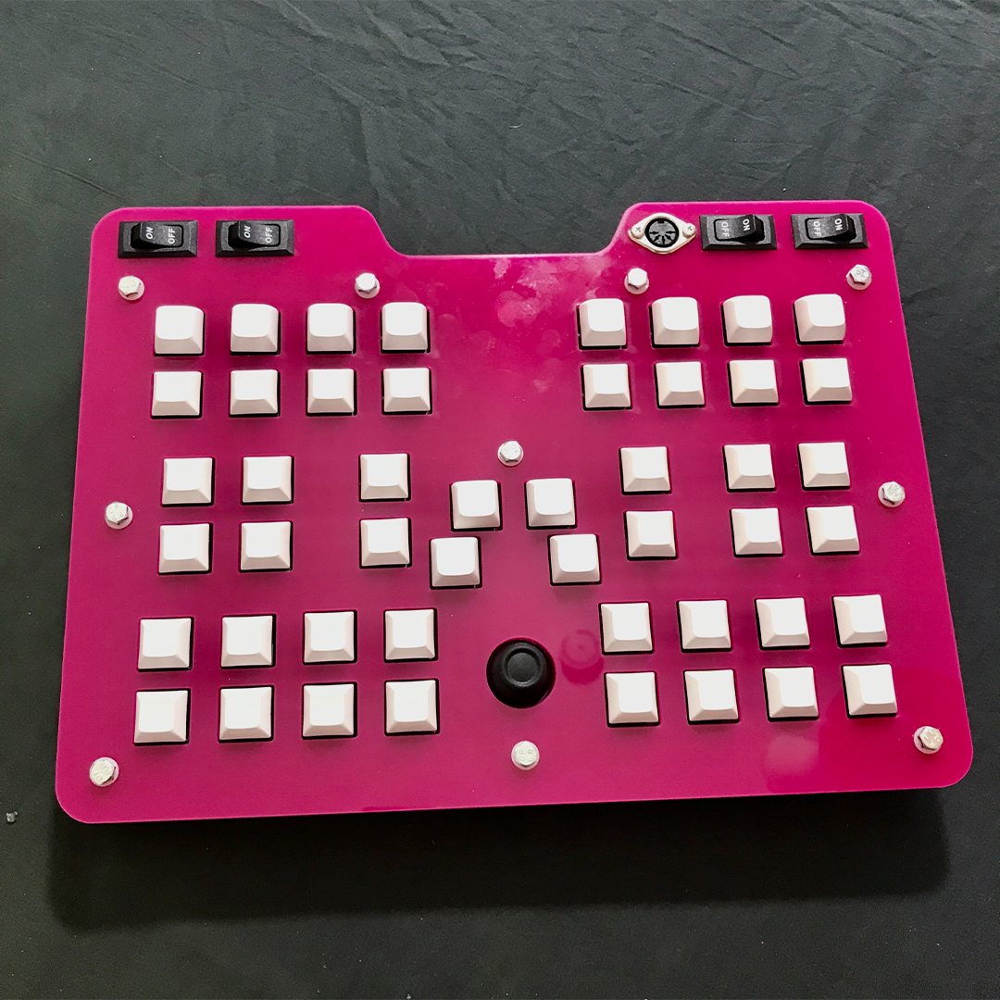
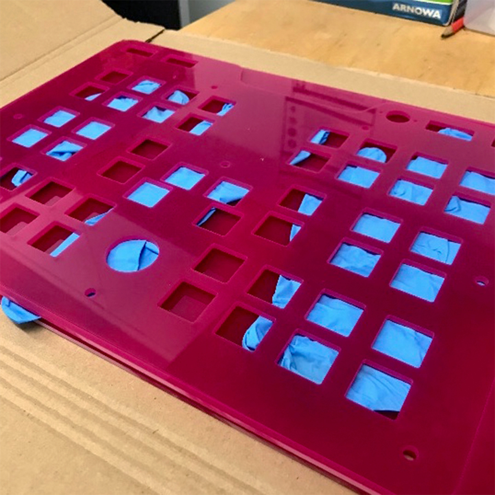
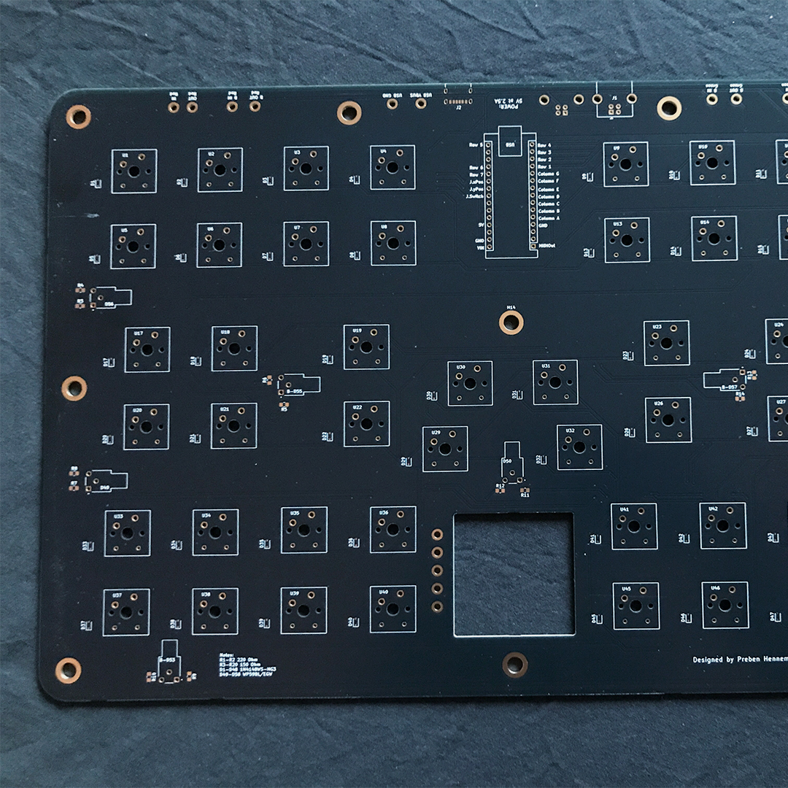
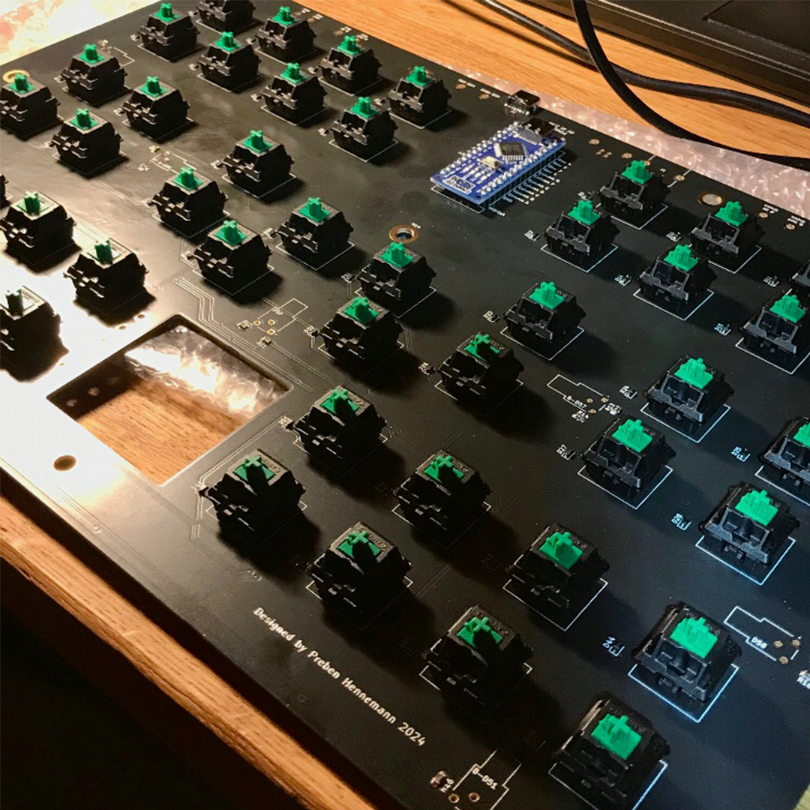
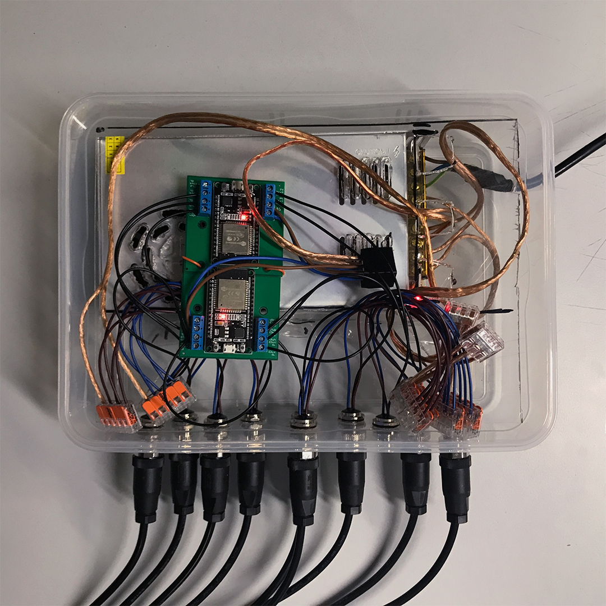
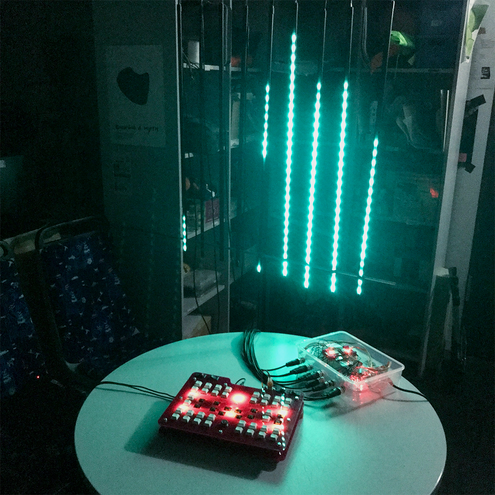

## Basic Idea

The underlying Idea was to create a Console where Visitors of Music Events can have a playful interaction with the onsight Lighting Setup and to please the unwilling urge to push buttons of (some) Guests. The Idea is to trigger the human urge to play and what isn‘t more fun  then a bunch of buttons and the possibilty to control Light which are a part of the main lighting Setup.

## Concept

The implementation of this Idea has --three-- Points that need to be realised: 

- The Console 
- Receiving and Converting the Signals
- The Lighting Setup

**The Console** is a self designed Hardware Controller based upon the MIDI Protocol. A Button press is converted inside an Arduino Nano to a MIDI Signal which can then be send over to any MIDI receiving Device thats out there. In our case it will be a Computer.

**The Signal** will then be grabbed by a Software Module inbefore the actual Lighting Software. So it‘s not just an click-through adventure but more of an Riddle. The button pushes will be connected through Logical Operators like „AND Gate“. So in order to unlock an Visual Event it is necessaryto push multiple buttons or multiple buttons in a Sequence to activate an Visual / Light Event. The Result of this Logical operations will then be send to the actual Lighting Setup.

**The Lighting Setup** consists out of two Things. One the Software which will give the Animations and the actual Lights which will receive the Animations. The Software in this Part is „Resolume Arena 6“ by Resolume. The Lights is a selfbuild Setup consisting of ten 1m LED-Strips with each of 29 LEDs where each LED has the Colours Red, Green and Blue. So it‘s possible to show a variety of Colours. 

