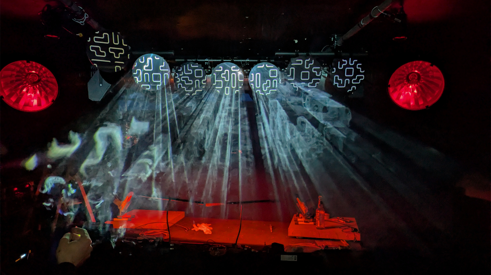
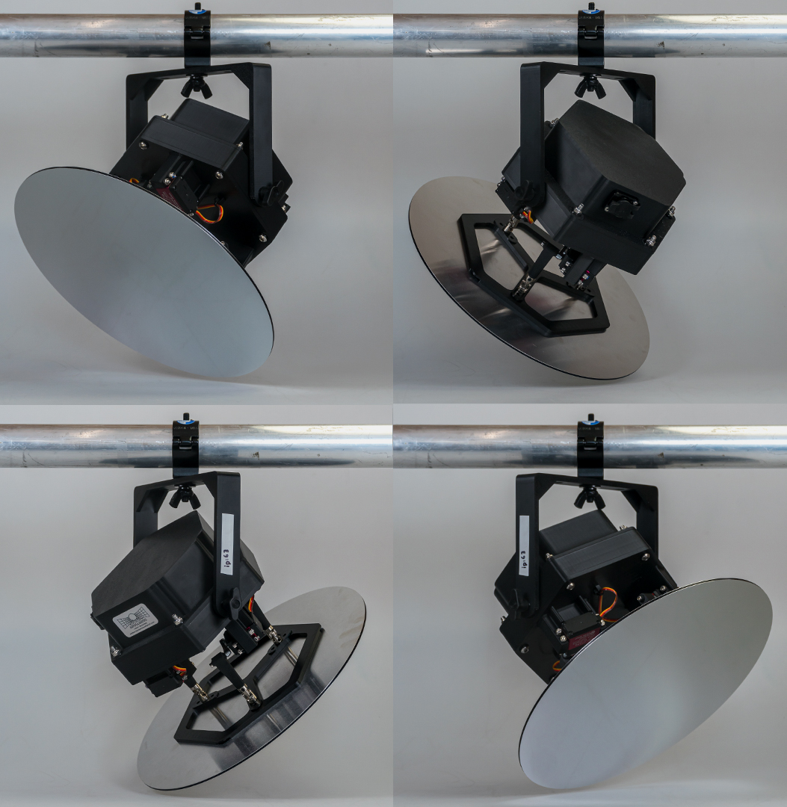
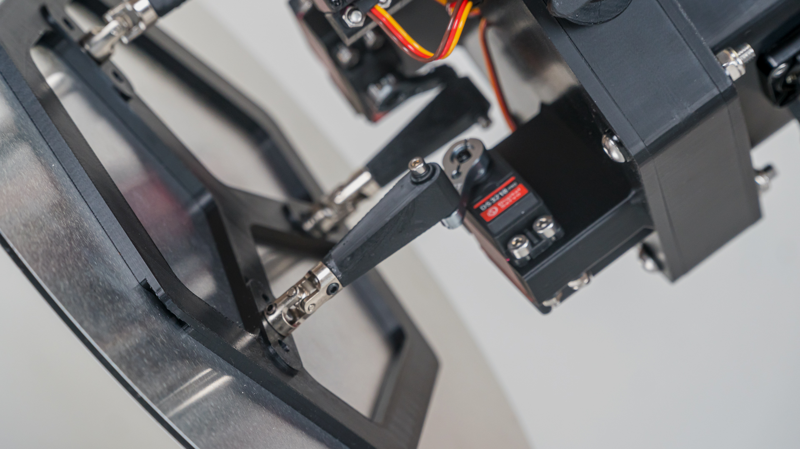
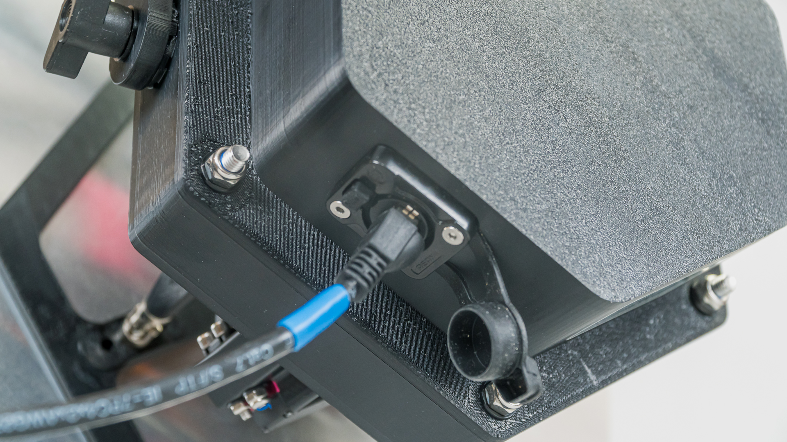
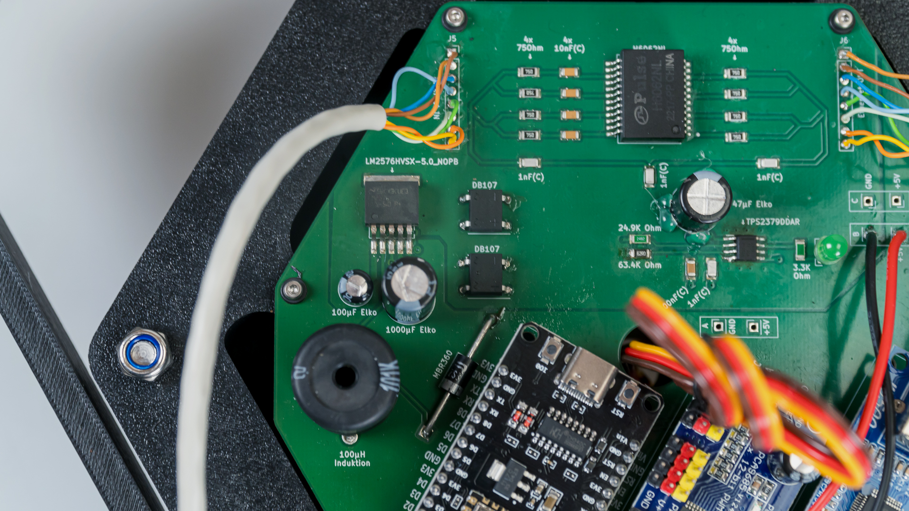

**Reflektoskop** is a modular, reflective & kinetic light installation consisting of multiple fixtures called **Scoptures Nodes**. Which was inspired by the fast and harsh environment of professional stage lighting equipment and the cosmic vision and complexity of the James Webb Space Telescope.
 

A **Scopture Node** is an ArtNet based and PoE+
powered device with a mirror in front. The mirror is moved by three servo motors in three dimensions of freedom. A Scopture Node can easily be set up. Just by connecting a node to a PoE+ capable Ethernet switch, which will then be connected to a ArtNet capable control device, usually a computer with appropriate software. 
 
 
 
The goal was to go through a complete production design and manufacturing process from idea to
deployment. Which resulted in a „Double Diamond Model” design process.
From idea to discovery, research and prototyping, defining the solution and developing it.

 

 

This project involved the development of the Scopture Nodes involving circuit and PCB design, programming of microcontrollers, 
developing the case and 3D printing it, as well as the final installation in an event and the complete organization of the event itself.
 
 

The first proper deplyoment happened at my colloquium at the 14th April 2026 in the Neu Bau (former "Bunker an'n Diek", "Krise") of the Zentrum für Kollektivkultur collective. As the Scopture Nodes where explicitly made for events, the colloquium was also organised as bar evening with music performances.

[Reflektoskop Youtube Video](https://www.youtube.com/watch?v=xS7-9J_DlcA) 

Credits: 
photo 1 - Lucca Vitters